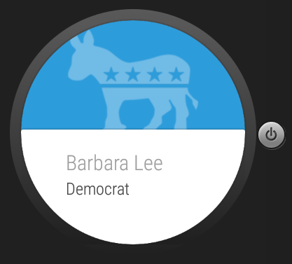

# PROG 02: Represent!

Get presidential facts on the go. Users can either enter a specific zip or get the current location to access a list of all senators and U.S. Representatives associated with that location (uses Sunlight API to access correct data). Both entered zip and current location are accurate and based on the Google Geolocation API. The app uses the APIs to display the congressperson’s full name, party, photo, email, website, and Twitter on both phone and watch. Users can shake the watch to get a new random location on the phone. The app has an easy-to-use, intuitive design and interaction flow. Also, each representative on the watch has an appropriately-colored background featuring the animal of his or her party. For a more complete list of features, see the submitted PDF and/or watch the demo video.

## Authors

Danielle Kenwood ([kenwood@berkeley.edu](mailto:kenwood@berkeley.edu))

## Demo Video

See latest [demo video] (https://youtu.be/aLseeYmSz9w)

## Screenshots

## Acknowledgments

* Staff's Catnip
* peceps on Stack Overflow for shaking functionality
